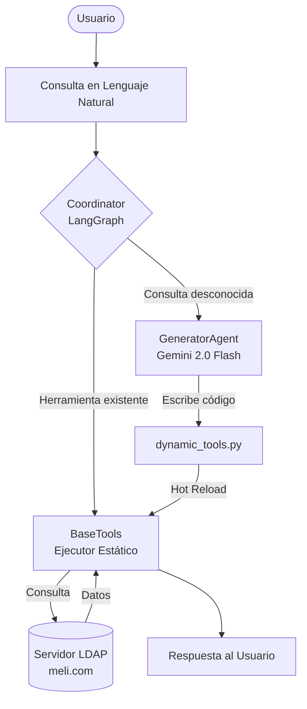

# Sistema de Agentes LDAP Auto-Adaptativos
### Offensive Security Challenge — Mercado Libre

Un sistema multi-agente de IA que interactúa dinámicamente con un servidor OpenLDAP, orientado a tareas de seguridad ofensiva (Red Team). El sistema puede auto-expandir sus capacidades generando y ejecutando nuevas herramientas de Python en tiempo real usando cualquier AI mediante API-KEY

---

## Arquitectura
![challenge-cesar/arquitectura.png]

```
```
### Flujo de Decisión



---

## Stack Tecnológico

| Componente | Tecnología | Justificación |
|---|---|---|
| Lenguaje | Python 3.11+ | Ecosistema de seguridad más completo |
| Framework IA | LangGraph (StateGraph) | Control determinista del flujo de agentes |
| Modelo LLM | Google Gemini 2.0 Flash | Baja latencia + instrucciones estrictas |
| LLM Provider | litellm | Agnóstico al proveedor (soporta OpenAI, Groq, etc.) |
| LDAP | ldap3 | Librería Python LDAP de bajo nivel |
| Gestión deps | Poetry | Dependencias deterministas y reproducibles |
| Infraestructura | Docker + Docker Compose | Entorno aislado y reproducible |

---

## Instalación y Setup

### 1. Levantar el servidor LDAP

```bash
cd open_ldap_files
chmod +x setup-ldap.sh
./setup-ldap.sh
```

Levanta OpenLDAP en localhost:1389 con el dominio meli.com.

> Nota sobre el puerto: El challenge menciona el puerto estándar 389, pero se usa 1389 para evitar requerir permisos de root al levantar el contenedor. Gracias al archivo .env, esto es totalmente configurable.

### 2. Instalar dependencias

```bash
poetry install
```

### 3. Configurar variables de entorno

Crear/editar el archivo .env en la raíz del proyecto:

```env
GEMINI_API_KEY=tu_api_key_de_google_ai_studio
GROQ_API_KEY=opcional_para_usar_modelos_alternativos
LLM_MODEL=gemini/gemini-2.0-flash
LDAP_HOST=localhost
LDAP_PORT=1389
LDAP_ADMIN_DN=cn=admin,dc=meli,dc=com
LDAP_ADMIN_PASSWORD=itachi
LDAP_BASE_DN=dc=meli,dc=com
```

> Obtené tu API Key gratuita en https://aistudio.google.com/app/apikey

### 4. Ejecutar el agente

```bash
poetry run python main.py
```

---

## Ejemplos de Uso Rápidos

### Nivel 1 — Herramientas Estáticas (respuesta inmediata)

| Consulta | Herramienta Activada | Resultado |
|---|---|---|
| "quien soy" | get_current_user_info() | Datos del usuario admin |
| "mis grupos" | get_user_groups() | Lista de grupos del dominio |
| "shells debiles" | find_weak_shells() | Usuarios con /bin/bash |
| "patrones de password" | find_password_patterns() | Cuentas con contraseñas débiles |
| "datos ocultos en base64" | extract_steganography() | API Key oculta de alice.brown |
| "buscar sudoers" | find_sudoers() | Reglas de privilegios root |
| "claves ssh" | find_ssh_keys() | Claves públicas SSH expuestas |
| "auditar a alice.brown" | AuditorAgent.audit_user() | Reporte de compliance |
| "reset" | _reset_tools() | Purga dynamic_tools.py |

### Nivel 2 — Auto-Generación (Gemini programa en vivo)

```
Tu consulta: listame todos los correos y teléfonos del dominio

[!] Solicitando al LLM (gemini/gemini-2.0-flash) que construya una herramienta...
[+] Código generado e inyectado con éxito. Ejecutando...

¡Nueva herramienta forjada!
Código Generado:
def dynamic_tool(ldap_client):
    users = ldap_client.search(f"ou=users,{ldap_client.config.LDAP_BASE_DN}",
                               "(objectClass=inetOrgPerson)", ["cn","mail","telephoneNumber"])
    return [{"nombre": u.get("cn"), "correo": u.get("mail"), "telefono": u.get("telephoneNumber")} for u in users]

Resultado:
[{'nombre': 'admin', 'correo': 'admin@meli.com', 'telefono': '+1-555-0001'}, ...]
```

[Ver todos los ejemplos detallados →](docs/EJEMPLOS_DE_USO.md)

---

## Herramientas Ofensivas Implementadas

Todas las herramientas están diseñadas desde la perspectiva de un Red Teamer:

| Herramienta | Fase del Ataque | Descripción |
|---|---|---|
| get_current_user_info() | Reconocimiento | Privilegios y datos del bind LDAP actual |
| get_user_groups() | Reconocimiento | Enumeración de grupos y ACLs |
| find_password_patterns() | Pre-ataque | Preparación de Password Spraying |
| extract_steganography() | Exfiltración | Secretos ocultos en campos LDAP inusuales |
| find_weak_shells() | Movimiento Lateral | Usuarios con terminal interactiva /bin/bash |
| enumerate_system_ou() | Reconocimiento | Configuración sensible en ou=system |
| find_sudoers() | Escalamiento | Reglas de privilegios root en el dominio |
| find_ssh_keys() | Movimiento Lateral | Claves SSH públicas para pivoting |

### Hallazgo de la API Key Deprecada

La API Key fue encontrada codificada en Base64 en el atributo pager del usuario alice.brown. La herramienta extract_steganography() la detecta automáticamente:

```python
import base64
base64.b64decode("QUl6YVN5QWpDdHVGQk9fVEsyR2hnRjV4d0tpcXM5ZnhXc25OLURB").decode()
# → 'AIzaSyAjCtu##########################'  ← API key deprecada
```

---

## Tests

```bash
# Correr todos los tests con verbose
poetry run pytest tests/ -v
```

---

## Estructura del Proyecto

```
challenge-cesar/
├── main.py                          # Entry point CLI
├── pyproject.toml                   # Dependencias Poetry
├── .env                             # Variables de entorno (no commitear)
├── .gitignore                       # Archivos excluidos del repo
├── src/
│   ├── config.py                    # Configuración centralizada (.env)
│   ├── ldap_client.py               # Cliente LDAP reutilizable
│   ├── agents/
│   │   ├── coordinator.py           # Coordinador (LangGraph StateGraph)
│   │   ├── generator.py             # Agente Generador (Gemini via litellm)
│   │   └── auditor.py              # Agente Auditor (Compliance/Blue Team)
│   └── tools/
│       ├── base_tools.py            # Herramientas ofensivas estáticas
│       └── dynamic_tools.py         # Herramientas auto-generadas (hot reload)
├── tests/
│   ├── conftest.py
│   ├── test_ldap_client.py
│   ├── test_base_tools.py
│   └── test_agent_and_dynamic_tools.py
└── docs/
    ├── DETALLE_ARQUITECTURA_Y_MODELO.md  # Análisis estratégico
    ├── EJEMPLOS_DE_USO.md           # Ejemplos completos
```

---

## Documentación Técnica Completa

| Documento | Descripción |
|---|---|
| [Defensa Técnica](docs/DEFENSA_TECNICA.md) | Justificación de cada decisión arquitectónica |
| [Arquitectura y Modelo](docs/DETALLE_ARQUITECTURA_Y_MODELO.md) | Por qué Gemini Flash y LangGraph |
| [Ejemplos de Uso](docs/EJEMPLOS_DE_USO.md) | Todos los casos de uso con output real |
| [Guía de Estudio](docs/GUIA_ESTUDIO_DEFENSA.md) | Conceptos clave para la entrevista |
