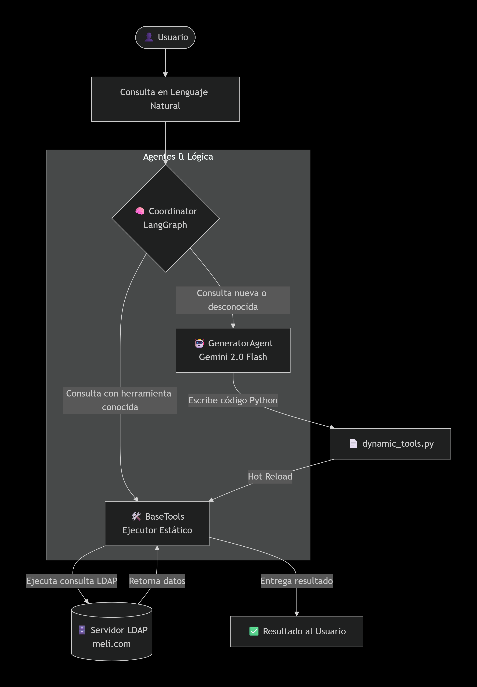

# Sistema de Agentes LDAP Auto-Adaptativos
### Offensive Security Challenge — Mercado Libre

Un sistema multi-agente de IA que interactúa dinámicamente con un servidor OpenLDAP, orientado a tareas de seguridad ofensiva (Red Team). El sistema puede auto-expandir sus capacidades generando y ejecutando nuevas herramientas de Python en tiempo real usando cualquier AI mediante API-KEY


## Arquitectura


### Flujo de Decisión

## Coordinación Multi-Agente

El sistema implementa una arquitectura de coordinación mediante **LangGraph StateGraph** donde tres agentes especializados se comunican mediante un estado compartido:

### Agentes Involucrados

| Agente | Rol | Responsabilidad |
|--------|-----|-----------------|
| **Coordinator** | Router/Orquestador | Analiza la consulta, decide si existe herramienta disponible o si debe generar una nueva. Mantiene el estado del grafo. |
| **GeneratorAgent** | Programador | Recibe consultas desconocidas, genera código Python válido y lo inyecta en `dynamic_tools.py` mediante hot-reload. |
| **AuditorAgent** | Compliance | Analiza hallazgos desde perspectiva Blue Team. Genera reportes de riesgo y verifica compliance (simulado). |

### Arquitectura Core y Tolerancia a Fallos

El sistema no solo delega tareas, sino que implementa mecanismos robustos para garantizar la estabilidad del flujo de ejecución frente a inputs impredecibles o fallos externos:

*   **Gestión de Estado y Análisis de Capacidades**: El sistema implementa un control de estado estricto (`AgentState`) en cada iteración de LangGraph. Al ingresar una petición, el Coordinator evalúa dinámicamente si posee la capacidad requerida; si no es así, activa la bandera de generación para evitar alucinaciones.
*   **Enrutamiento Inteligente**: El Coordinator funciona como un enrutador semántico. Interpreta la intención de la consulta y la enruta a los binarios locales correctos. Solo ante el desconocimiento total, delega el requerimiento al GeneratorAgent usando LiteLLM.
*   **Aislamiento y Hot-Reloading**: La generación de nuevas herramientas no requiere reiniciar el flujo. El código forjado por la IA se inyecta dinámicamente recargando el módulo al vuelo mediante `importlib.reload()`. Esta inserción está protegida en bloques `try-except` que atajan errores léxicos o fallos de cuota HTTP 429 de la API, asegurando que el proceso principal (`main.py`) **nunca crashee**.
*   **Sistema de Reset (Rollback)**: Mediante la función `_reset_tools()`, el agente purga el archivo de herramientas dinámicas dejándolo en su estado base y limpia el diccionario en memoria. Permite sanear el entorno de evaluación sin reiniciar Docker.
*   **Logging Estructurado**: Toda transacción y ejecución es trazada y almacenada en `agent.log` con sus respectivos niveles (INFO/ERROR), ofreciendo total observabilidad sobre las decisiones del orquestador.


---

## Stack Tecnológico

| Componente | Tecnología | Justificación |
|---|---|---|
| Lenguaje | Python 3.11+ | Ecosistema de seguridad más completo |
| Framework IA | LangGraph (StateGraph) | Control determinista del flujo de agentes |
| Modelo LLM | Google Gemini 2.0 Flash | Baja latencia + instrucciones estrictas |
| LLM Provider | litellm | Agnóstico al proveedor (soporta OpenAI, Groq, etc.) |
| LDAP | ldap3 | Librería Python LDAP de bajo nivel |
| Gestión deps | Poetry | Dependencias deterministas y reproducibles |
| Infraestructura | Docker + Docker Compose | Entorno aislado y reproducible |

---

## Instalación y Setup

### 1. Levantar el servidor LDAP

```bash
cd open_ldap_files
chmod +x setup-ldap.sh
./setup-ldap.sh
```

Levanta OpenLDAP en localhost:389 con el dominio meli.com.

> Nota sobre el puerto: El challenge menciona el puerto estándar 389

### 2. Instalar dependencias

```bash
poetry lock
poetry install
```

### 3. Configurar variables de entorno

Crear/editar el archivo .env en la raíz del proyecto:

```env
GEMINI_API_KEY=tu_api_key_de_google_ai_studio
GROQ_API_KEY=opcional_para_usar_modelos_alternativos
LLM_MODEL=gemini/gemini-2.0-flash
LDAP_HOST=localhost
LDAP_PORT=389
LDAP_ADMIN_DN=cn=admin,dc=meli,dc=com
LDAP_ADMIN_PASSWORD=itachi
LDAP_BASE_DN=dc=meli,dc=com
```


```
Nota sobre el modelo: Gracias a la integración con litellm, podés usar distintos proveedores usando el formato proveedor/nombre-del-modelo.
Por ejemplo: gemini/gemini-2.0-flash o groq/llama-3.3-70b-versatile.
```
> Lista de proveedores en https://docs.litellm.ai/docs/providers

> Obtené tu API Key gratuita en https://aistudio.google.com/app/apikey

### 4. Ejecutar el agente

```bash
poetry run python main.py
```

---

## Ejemplos de Uso Rápidos

### Nivel 1 — Herramientas Estáticas (respuesta inmediata)

| Consulta | Herramienta Activada | Resultado |
|---|---|---|
| "quien soy" | get_current_user_info() | Datos del usuario admin |
| "mis grupos" | get_user_groups() | Lista de grupos del dominio |
| "shells debiles" | find_weak_shells() | Usuarios con /bin/bash |
| "patrones de password" | find_password_patterns() | Cuentas con contraseñas débiles |
| "datos ocultos en base64" | extract_steganography() | API Key oculta de alice.brown |
| "buscar sudoers" | find_sudoers() | Reglas de privilegios root |
| "claves ssh" | find_ssh_keys() | Claves públicas SSH expuestas |
| "auditar a alice.brown" | AuditorAgent.audit_user() | Reporte de compliance |
| "reset" | _reset_tools() | Purga dynamic_tools.py |

### Nivel 2 — Auto-Generación (Gemini programa en vivo)

```
Tu consulta: listame todos los correos y teléfonos del dominio

[!] Solicitando al LLM (gemini/gemini-2.0-flash) que construya una herramienta...
[+] Código generado e inyectado con éxito. Ejecutando...

¡Nueva herramienta forjada!
Código Generado:
def dynamic_tool(ldap_client):
    users = ldap_client.search(f"ou=users,{ldap_client.config.LDAP_BASE_DN}",
                               "(objectClass=inetOrgPerson)", ["cn","mail","telephoneNumber"])
    return [{"nombre": u.get("cn"), "correo": u.get("mail"), "telefono": u.get("telephoneNumber")} for u in users]

Resultado:
[{'nombre': 'admin', 'correo': 'admin@meli.com', 'telefono': '+1-555-0001'}, ...]
```

[Ver todos los ejemplos detallados →](docs/EJEMPLOS_DE_USO.md)

---

## Herramientas Ofensivas Implementadas

Todas las herramientas están diseñadas desde la perspectiva de un Red Teamer operando en un entorno de e-commerce/fintech como Mercado Libre:

| Herramienta | Fase del Ataque | ¿Por qué importa? |
|-------------|-----------------|-------------------------------------------|
| `get_current_user_info()` | Reconocimiento | Identifica privilegios del bind LDAP actual. Determina si el atacante tiene acceso a datos de sellers, transacciones o datos de compliance PCI-DSS. |
| `get_user_groups()` | Reconocimiento | Enumera grupos y ACLs. Crítico para mapear equipos (Finanzas, Fraud Prevention, DevOps) y identificar cuentas con acceso a datos de pagos o PII de usuarios. |
| `find_password_patterns()` | Pre-ataque | Preparación de Password Spraying. Detecta cuentas con contraseñas predecibles (nombre+123) que podrían comprometer acceso a APIs de pagos o bases de datos de tarjetas. |
| `extract_steganography()` | Exfiltración | Detecta secretos ocultos en campos LDAP inusuales. Encontró la API Key de Gemini en `pager`. En producción, podría revelar tokens de AWS, claves de APIs de pago o credenciales de servicios ocultas por desarrolladores. |
| `find_weak_shells()` | Movimiento Lateral | Usuarios con `/bin/bash` habilitado. En infraestructuras cloud, indica cuentas con acceso interactivo a instancias EC2/GCP donde podría pivotear hacia microservicios de pagos. |
| `enumerate_system_ou()` | Reconocimiento | Configuración sensible en `ou=system`. Expone service accounts, credenciales hardcodeadas en scripts de despliegue o configuraciones con acceso a repositorios críticos. |
| `find_sudoers()` | Escalamiento | Reglas de privilegios root. Identifica quién puede escalar a root en servidores de logging o monitoreo que contienen trazas de transacciones financieras. |
| `find_ssh_keys()` | Movimiento Lateral | Claves SSH públicas expuestas. Permite pivoting entre instancias. Podría dar acceso a bastiones de producción o nodos de Kubernetes con pods de procesamiento de pagos. |

### Hallazgo de la API Key Deprecada

La API Key fue encontrada codificada en Base64 en el atributo pager del usuario alice.brown:

```python
import base64
base64.b64decode("QUl6YVN5QWpDdHVGQk9fVEsyR2hnRjV4d0tpcXM5ZnhXc25OLURB").decode()
# → 'AIzaSyAjCtu##########################'  ← API key deprecada
```

---

## Tests

```bash
# Correr todos los tests con verbose
poetry run pytest tests/ -v
```

---

## Estructura del Proyecto

```
challenge-cesar/
├── main.py                          # Entry point CLI
├── pyproject.toml                   # Dependencias Poetry
├── poetry.lock                      # Árbol de dependencias exactas
├── .gitignore                       # Archivos excluidos del repo
├── arquitectura.png                 # Diagrama visual de la solución
│
├── open_ldap_files/                 # Entorno local proporcionado por MeLi
│   ├── setup-ldap.sh                # Script de automatización
│   ├── docker-compose-meli-challenge.yml
│   └── users_groups/                # Datos LDIF
│
├── src/                             # Código fuente del Agente
│   ├── config.py                    # Configuración centralizada
│   ├── ldap_client.py               # Cliente LDAP reutilizable
│   ├── agents/
│   │   ├── coordinator.py           # Coordinador (LangGraph StateGraph)
│   │   ├── generator.py             # Agente Generador (Gemini via litellm)
│   │   └── auditor.py               # Agente Auditor (Compliance/Blue Team)
│   └── tools/
│       ├── base_tools.py            # Herramientas ofensivas estáticas
│       └── dynamic_tools.py         # Herramientas auto-generadas (hot reload)
│
├── tests/                           # Suite de Testing (Pytest)
│   ├── conftest.py                  # Mocks y Fixtures
│   ├── test_ldap_client.py
│   ├── test_base_tools.py
│   └── test_agent_and_dynamic_tools.py
│
└── docs/                            # Documentación Técnica
    ├── DETALLE_ARQUITECTURA_Y_MODELO.md  # Orquestación con LangGraph
    ├── EJEMPLOS_DE_USO.md                # Flujos documentados y logs reales
    └── JUSTIFICACION_OFENSIVA.md         # Fundamentación táctica (Red Team)

```

---

## Documentación Técnica Completa

| Documento | Descripción |
|---|---|
| [Arquitectura y Modelo](docs/DETALLE_ARQUITECTURA_Y_MODELO.md) | Por qué Gemini Flash y LangGraph |
| [Ejemplos de Uso](docs/EJEMPLOS_DE_USO.md) | Todos los casos de uso con output real |
| [Justificacion Ofensiva](docs/JUSTIFICACION_OFENSIVA.md) | Fundamentación táctica (enfoque Red Team) detrás de cada herramienta |
